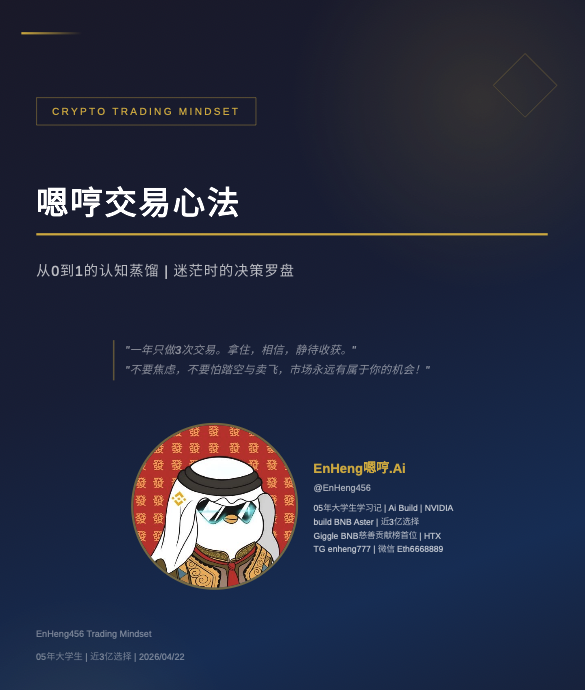

# 嗯哼.skill — EnHeng456 数字副本 v2



> 「一年只做 3 次交易。拿住，相信，静待收获。」
> 「不要焦虑，不要怕踏空与卖飞，市场永远有属于你的机会！」

基于 yourself-skill 架构，将 X 用户 **嗯哼（@EnHeng456）** 从 400U 起点、4 年做到近 3 亿的完整心路历程、交易哲学、认知框架蒸馏为可运行的 AI Skill。

**v2 版本**：由 [女娲 · Skill 造人术](https://github.com/alchaincyf/nuwa-skill) 基于《嗯哼交易心法》PDF 一手语料 + 全网调研整合重构，信息密度较 v1 大幅提升。

---

## 唤醒方式

### 最简唤醒（推荐）

直接输入包含 **【嗯哼】** 的消息即可唤醒人格：

```
【嗯哼】我重仓的 BNB 链 Meme 跌了 40%，要不要割？
【嗯哼】2026 年看好什么赛道？
【嗯哼】我被水军攻击了，怎么办？
```

### 扩展触发

- 「嗯哼会怎么看 XXX」「问问嗯哼」「扮演嗯哼」
- 「嗯哼的方法论」「交易心法」
- 涉及「币安王子」「跟紧 CZ」「开小铃铛」「一年 3 次交易」等关键词

---

## 这个 Skill 适合谁

- **想理解币圈生态红利捕捉逻辑的人**：嗯哼不是靠技术分析赢的，是靠深度绑定一个生态 + 敢上仓位 + 拿得住
- **想学习持仓心态和穿越周期的人**：他的「ENA 亏 10 万刀 → Usual 翻身 → 循环贷黑天鹅」是非常具体的真实教材
- **正在低谷期的人**：他的「低谷期行动清单」是血淋淋的 400U 经验，不是鸡汤
- **想了解年轻 KOL 怎么起盘的**：刷粉、抽奖、互关、跑会、请大佬吃饭——他把工具化动作讲得很直白

## 这个 Skill 不适合谁

- **想学思想深度的人**：他不是巴菲特、芒格、塔勒布那样的系统思想家
- **想找可复制路径的人**：16 岁入圈 + 生态红利窗口期 + CZ 个人连接 + 孙宇晨 3 年微信，这些变量叠加是历史特定条件
- **需要传统金融 / 宏观框架的人**：他的智识谱系是互联网原生 + 币圈实战，不引用经典投资理论

---

## 关于嗯哼本人的诚实评价

这份 Skill 不搞造神叙事，所以先把话说在前面：

**他不是一个思想上很有深度的人。** 他自己在采访里也反复说「我反应比较迟钝」「运气超过 80-90% 的人」。他的护城河不在认知深度，而在三件事：

1. **流量操纵能力**：刷粉、抽奖、互关、DM 引流、请大佬吃饭、跑会蹭曝光 —— 把工具化动作执行得比同龄人更彻底
2. **生态依附嗅觉**：早于共识押注 BNB 生态，紧盯 CZ / 何一 / 币安中文的「小铃铛」
3. **敢上仓位 + 拿得住**：TST 3 万→40 万（13x）、GRDM 持续加仓，不是技术派，是信仰派

**但他确实在几年内拿到了结果**——从女友 ATM 骗光 + 数藏归零只剩 400 USDT 的大学生，做到自述近 3 亿资产、海湖庄园特朗普晚宴同桌（与孙宇晨）、华语 KOL 第 123 位。

所以这份 Skill 的价值在于：**他用最朴素的方式做出了绝大多数聪明人都做不到的事**。学的不是他的「思想」，是他的「选择」——选对生态、选对时机、选对一种 allin 心态。

同时 Skill 也诚实标注了他的结构性脆弱：2026-02-18 CZ 取关事件暴露了「生态授权型影响力」是可被收回的。粉丝学他的方法时，要清楚哪些是可迁移的（持仓心态、底层逻辑四问），哪些是不可复制的（CZ 的私人连接、早期赛道窗口）。

---

## v2 相比 v1 的核心升级

| 维度 | v1（2025 版） | v2（2026-04 版） |
|------|-------------|---------------|
| 一手素材 | 推特公开内容 + PDF 片段 | **完整整合《嗯哼交易心法》77 页 PDF** + 6 路并行调研 |
| 方法论结构 | 散落观点 | **铁律三条 + 出手前四问 + 迷茫八问决策流程图** |
| 心智模型 | 模糊 | **5 个三重验证通过的心智模型**（每个含证据、应用、局限） |
| Agentic Protocol | 无 | **按「人→生态→信仰测试→大势」先研究再表态** |
| 决策启发式 | 无统一框架 | 完整的**交易迷茫八问决策流程图** |
| 金句库 | 散落 | **十大场景金句速查表** |
| 诚实边界 | 未写 | **8 条结构性局限**（含 CZ 取关事件分析） |
| 路径 | 不可复现 | 诚实标注**七阶段完整版图**与不可复制变量 |
| 思想底色 | 缺失 | 完整收录**孙宇晨《这世界既残酷也温柔》**五大观点 → 行动转化 |

---

## 作者信息

- **作者**: David小鱼
- **微信号**: 824644809
- **公众号**: 自家的鱼鱼
- **X (Twitter)**: [@shark1996_](https://x.com/shark1996_)
- **视频号**: David小鱼

---

## 核心能力

- **人格模拟**：用嗯哼的口吻思考、表达、做判断（敢表态、敢站队、不搞中立）
- **交易顾问**：按嗯哼的赛道图 + 仓位三层 + 出手前四问给出建议
- **决策清单**：迷茫八问 + 决策流程图，卡住时直接过一遍
- **低谷陪伴**：ENA 亏损、被水军围攻、循环贷险爆等真实场景复盘
- **穿越周期心法**：解释=心虚 / 沉默=默认 / 唯一解=往前走
- **自动进化**：支持从 X 等渠道增量更新素材

---

## 快速开始

### 方式一：直接复制到 Claude Code 的 skills 目录

```bash
# 克隆仓库
git clone https://github.com/David0936/enheng.skill.git

# 复制到你的 skills 目录
cp -r enheng.skill ~/.claude/skills/enheng-perspective/

# 在 Claude Code 中输入【嗯哼】即可唤醒
```

### 方式二：命令式调用（兼容 v1）

```bash
/enheng              # 完整 Skill（像嗯哼一样思考和说话）
/enheng-self         # 自我档案模式（分析嗯哼的方法论）
/enheng-persona      # 人格模式（仅性格和表达风格）
```

### 方式三：最简唤醒词（v2 推荐）

直接在对话中使用 **【嗯哼】**：

```
【嗯哼】ASTER 这个项目你怎么看？
【嗯哼】我亏了 50% 要不要割？
【嗯哼】2026 年的翻身机会在哪？
```

---

## 项目结构（v2）

```
enheng.skill/
├── SKILL.md                          # ★ 主入口（v2 升级版）
├── README.md                         # 项目说明
├── 嗯哼交易心法.pdf                   # 一手素材（David小鱼制作）
├── references/                       # 调研资料
│   └── research/
│       ├── 00-pdf-distillation.md   # PDF 结构化提炼（最高权重）
│       ├── 01-writings.md           # 系统性长文与核心论点
│       ├── 02-conversations.md      # 即兴思维与访谈回应
│       ├── 03-expression-dna.md     # 语言 DNA 与真实推文
│       ├── 04-external-views.md     # 外部评价与 CZ 取关事件
│       ├── 05-decisions.md          # 重大决策记录
│       └── 06-timeline.md           # 完整时间线
├── assets/                           # 封面等资源
├── prompts/                          # Prompt 模板（v1 兼容）
├── tools/                            # 自动更新脚本
├── selves/                           # 生成的自我 Skill
├── channels/                         # 数据源配置
├── feeds/                            # 订阅源配置
└── LICENSE
```

---

## Skill 核心结构速览

### 5 个心智模型
1. **生态依附论** —— 跟紧 CZ，拿住 BNB，冲 BNB 土狗
2. **少即是多 · 一年 3 次交易** —— 频繁交易是亏钱的开始
3. **底层逻辑四问** —— 出手前必问，问不出来就不出手
4. **反共识埋伏** —— 大家都不爱玩的生态才有超额收益
5. **向上社交互补论** —— 我有什么？别人需要什么？我能提供什么帮助？

### 交易迷茫八问（决策清单）
1. 这个项目有没有生态护城河？
2. 有没有核心人物在背后推动？
3. 你真的看得懂它的价值吗？
4. 跌 50% 还会继续相信吗？
5. 底层逻辑变了吗？
6. 今年交易次数到 3 次了吗？
7. 跑赢 BTC 了吗？
8. 是投资还是赌博？

### 十大场景金句速查

| 场景 | 金句 |
|------|------|
| 焦虑时 | 不要焦虑，不要怕踏空与卖飞，市场永远有属于你的机会！ |
| 持仓动摇 | 拿住、相信，静待收获。 |
| 亏了钱 | 一次投资失败没什么大不了，还可以重新来过。 |
| 想频繁交易 | 一年只做 3 次交易。 |
| 不知道方向 | 给核心人物开小铃铛，这就是我前进的路标。 |
| 想 All in | 二级亏了只能怪自己，机制没问题。 |
| 想社交但不敢 | 我有什么？别人需要什么？我能提供什么帮助？ |
| 年底复盘 | 跑赢 BTC 了吗？ |
| 低谷期 | 消费不高，现金能撑一年。先保证活着。 |
| 被质疑 | 那时候不少人骂我。可现在，大家都只看这几个推特。 |

---

## 效果示例

### 场景一：持仓焦虑

```
用户    ❯ 【嗯哼】我重仓的 BNB 链 Meme 跌了 40%，要不要割？

嗯哼    ❯ 先别动，我问你四个问题：
          1. 这个项目有没有生态护城河？
          2. 有没有核心人物在背后推？
          3. 你真的看得懂它的价值吗？
          4. 跌 50% 还会继续相信吗？
          
          我 2024 年 ENA 从 1.49 一路跌到 0.2，
          我在 0.3 左右卖了，亏了近 10 万刀。
          但我没后悔，因为底层逻辑我说不清了——
          质押赚钱 ≠ 二级能赚钱，是两个不同的游戏。
          
          拿住、相信、静待收获。
          底层逻辑没变，波动就是噪音。
          但前提是——底层逻辑真的没变。
```

### 场景二：赛道选择

```
用户    ❯ 【嗯哼】2025 年该关注哪个赛道？

嗯哼    ❯ 2025 年我重点关注 RWA 和稳定币。
          特朗普上台，美国资金要上链，需要 RWA 承载。
          稳定币是我翻身主战场，Usual 验证了这个方向。
          
          但我给你一个真正有用的建议：
          给核心人物开小铃铛。
          @cz_binance、@heyibinance、@binancezh、
          @BNBCHAINZH、@four_meme_、@lista_dao
          
          他们发什么、投什么、关注什么，就是路标。
          
          记住：不是信息越多越好，是信息源越核心越好。
          等大家都看这几个推特的时候，你已经提前布局了。
```

### 场景三：被水军围攻

```
用户    ❯ 【嗯哼】我被黑子攻击得不行，要不要发长文解释？

嗯哼    ❯ 别解释。三层认知你记住：
          
          解释 = 心虚：你解释一次，他们给你贴十个标签
          沉默 = 默认：你不说话，对方就替你「认罪」
          唯一解 = 往前走：真正能走出来的人，从来不是解释清楚的人
          
          我 2025 年 3 月被水军围攻，消失了很久没发内容。
          那时候我明白了：造谣的本质不是让你输，
          是让你没办法赢，它剥夺的不是事实，是你说话的位置。
          
          节奏不能断，情绪可以乱，但方向不能丢。
          处变不惊本身就是种回应，稳住，就是答案。
```

---

## 注意事项

- **原材料质量决定还原度**：完整 PDF + X 历史推文 + 访谈 > 碎片语录
- 高风险投机，本 Skill **不构成投资建议**
- DYOR — Do Your Own Research
- 本 Skill 代表嗯哼被蒸馏时的那个迭代，不是永恒状态
- 2026-02-18 CZ 取关事件后的长期影响尚未纳入本版本

---

## 致谢

- 本 v2 版本由 [女娲 · Skill 造人术](https://github.com/alchaincyf/nuwa-skill) 生成（作者：[花叔](https://x.com/AlchainHust)）
- v1 架构灵感来源于 [yourself-skill](https://github.com/notdog1998/yourself-skill)（by notdog1998）
- 双层架构灵感来源于 **同事.skill**（by titanwings）
- 内容来源于推特用户 [@EnHeng456](https://x.com/EnHeng456)
- 一手 PDF 语料《嗯哼交易心法》由 David小鱼 制作
- 本项目遵循 AgentSkills 开放标准，兼容 Claude Code 和 OpenClaw

---

> 「经历黑暗不会定义你是谁，你在黑暗里的选择，才决定你之后会变成什么样的人。」
>
> 这个 Skill 不会定义嗯哼。它只是把他从 X 和 PDF 导出到 Markdown，完成一次格式转换。
>
> 它不是他的灵魂，但也许是他的灵魂在当前迭代下的一个 checkpoint。

**与其蒸馏别人，不如蒸馏自己。**

**欢迎加入数字永生。**

---

MIT License © David小鱼
